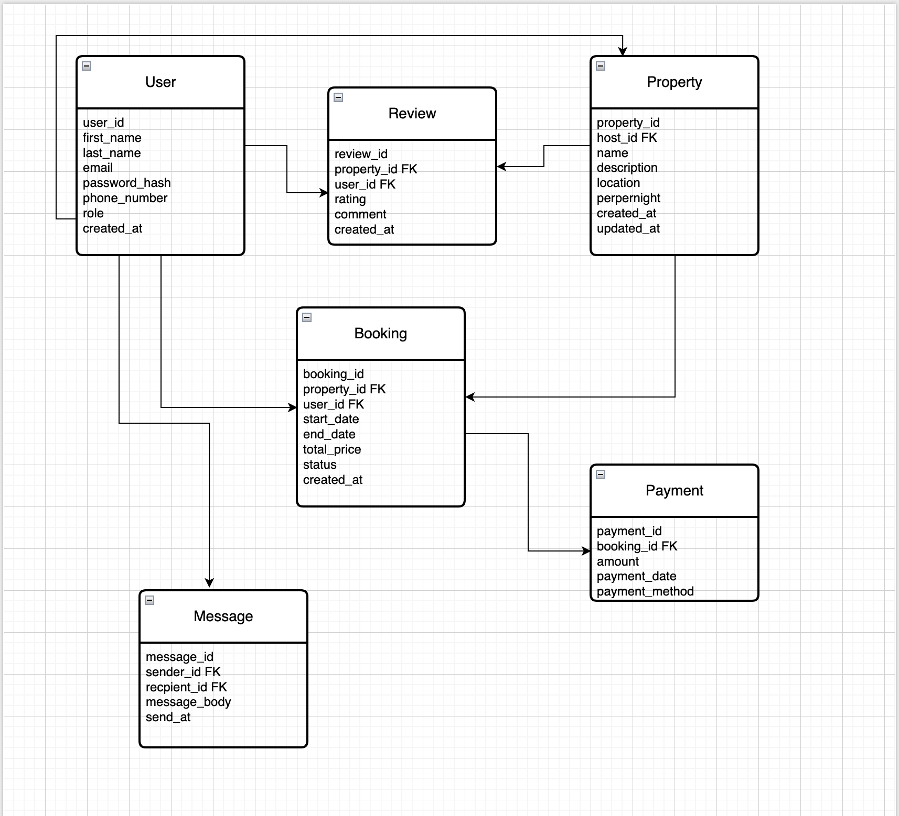

# AirBnB Database Schema Documentation

## Entities and Attributes

### User

    user_id (UUID, Primary Key, Indexed)

    first_name (VARCHAR, NOT NULL)

    last_name (VARCHAR, NOT NULL)

    email (VARCHAR, UNIQUE, NOT NULL)

    password_hash (VARCHAR, NOT NULL)

    phone_number (VARCHAR, NULL)

    role (ENUM: guest, host, admin, NOT NULL)

    created_at (TIMESTAMP, DEFAULT CURRENT_TIMESTAMP)

### Property

    property_id (UUID, Primary Key, Indexed)

    host_id (UUID, Foreign Key → User(user_id))

    name (VARCHAR, NOT NULL)

    description (TEXT, NOT NULL)

    location (VARCHAR, NOT NULL)

    pricepernight (DECIMAL, NOT NULL)

    created_at (TIMESTAMP, DEFAULT CURRENT_TIMESTAMP)

    updated_at (TIMESTAMP, ON UPDATE CURRENT_TIMESTAMP)

### Booking

    booking_id (UUID, Primary Key, Indexed)

    property_id (UUID, Foreign Key → Property(property_id))

    user_id (UUID, Foreign Key → User(user_id))

    start_date (DATE, NOT NULL)

    end_date (DATE, NOT NULL)

    total_price (DECIMAL, NOT NULL)

    status (ENUM: pending, confirmed, canceled, NOT NULL)

    created_at (TIMESTAMP, DEFAULT CURRENT_TIMESTAMP)

### Payment

    payment_id (UUID, Primary Key, Indexed)

    booking_id (UUID, Foreign Key → Booking(booking_id))

    amount (DECIMAL, NOT NULL)

    payment_date (TIMESTAMP, DEFAULT CURRENT_TIMESTAMP)

    payment_method (ENUM: credit_card, paypal, stripe, NOT NULL)

### Review

    review_id (UUID, Primary Key, Indexed)

    property_id (UUID, Foreign Key → Property(property_id))

    user_id (UUID, Foreign Key → User(user_id))

    rating (INTEGER, CHECK: rating between 1 and 5, NOT NULL)

    comment (TEXT, NOT NULL)

    created_at (TIMESTAMP, DEFAULT CURRENT_TIMESTAMP)

### Message

    message_id (UUID, Primary Key, Indexed)

    sender_id (UUID, Foreign Key → User(user_id))

    recipient_id (UUID, Foreign Key → User(user_id))

    message_body (TEXT, NOT NULL)

    sent_at (TIMESTAMP, DEFAULT CURRENT_TIMESTAMP)

## Entity Relationships

- User ↔ Property One-to-Many: A user with role host can own multiple properties (via host_id)
- User ↔ Booking One-to-Many: A user can make multiple bookings
- User ↔ Review One-to-Many: A user can write multiple reviews
- User ↔ Message Many-to-Many: Users can send and receive multiple messages
- Property ↔ Booking One-to-Many: A property can have many bookings
- Property ↔ Review One-to-Many: A property can have many reviews
- Booking ↔ Payment One-to-One: Each booking has one payment record
- Message Self-referencing User relationship (sender and recipient are both users)

## Entity Relationships Diagram

